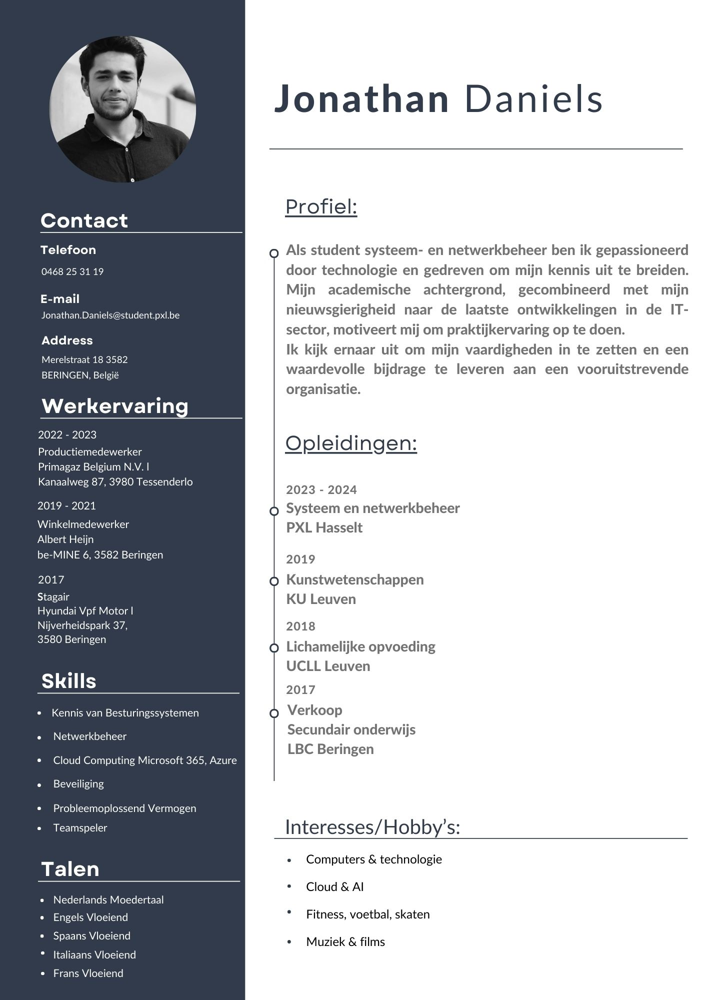

# Inleiding

✨ Welkom op mijn Portfolio! ✨

Welkom op mijn GitHub-pagina, waar ik jullie graag meeneem in mijn persoonlijke traject aan hogeschool PXL tijdens mijn graduaatsopleiding Systeem- en Netwerkbeheer. Hier deel ik alles wat ik de komende twee jaar zal leren, ontdekken en realiseren — van interessante projecten tot mijn eigen inzichten en reflecties.

Op deze pagina krijg je een inkijk in wie ik ben, waarom ik voor deze opleiding heb gekozen en welke uitdagingen ik ben aangegaan tijdens mijn werkplekleren (WPL). Je vindt hier een chronologisch overzicht van de opdrachten en projecten waaraan ik werk — zowel de leuke als de meer uitdagende taken. Daarnaast documenteer ik ook mijn stages, leerervaringen en groei als IT-professional.

Wat je zeker mag verwachten, is een stukje zelfreflectie. Hoe kijk ik terug op bepaalde opdrachten? Wat heb ik geleerd? Welke skills heb ik verbeterd? Dit portfolio is meer dan enkel een verzameling taken; het is mijn persoonlijk groeiboek in IT!

Ik hoop dat deze pagina niet alleen mijn eigen groei weerspiegelt, maar ook anderen inspireert om voortdurend bij te leren en nieuwe uitdagingen aan te gaan. 💻🚀

Veel leesplezier! 😊

# Persoonlijke info

 

[CV_DanielsJonathan](https://github.com/PXL-Digital-SNE-Werkplekleren/portfolio-JonathanDanielsPXL/blob/main/CV_Jonathan_Daniels.pdf)

