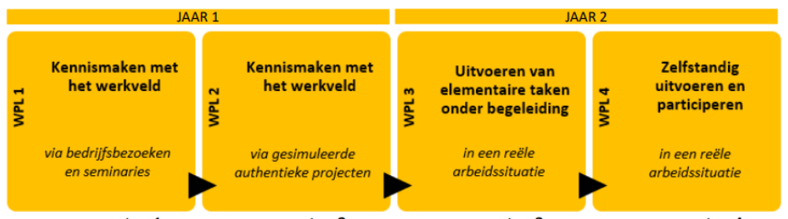
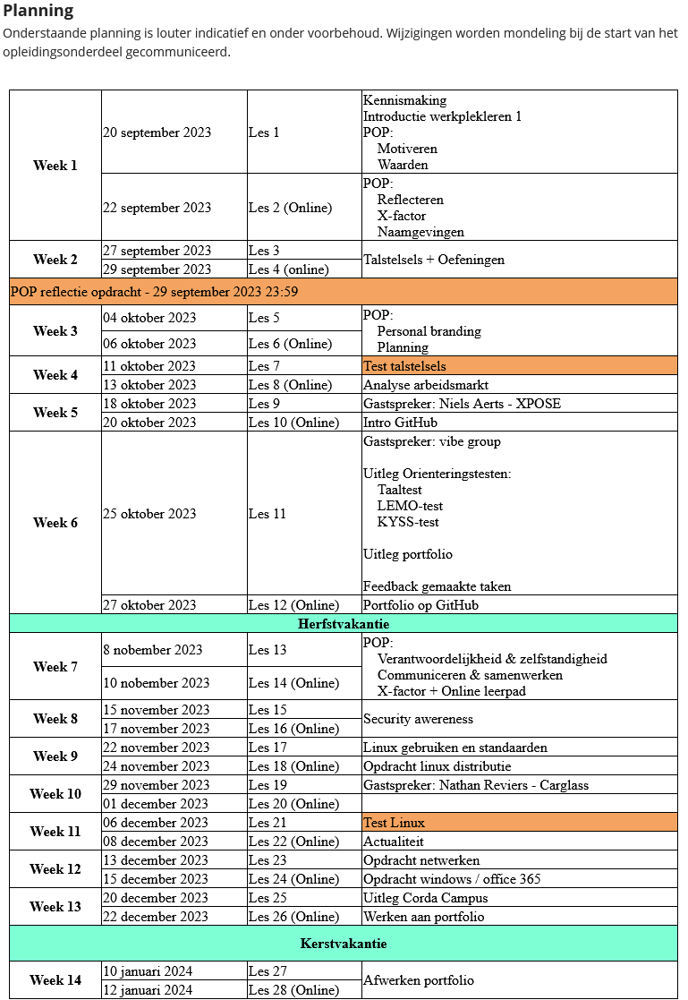

# Logboek werkplekleren

## Logboek WPL 1

Werkplekleren is een belangrijk onderdeel in de studie van het Graduaat Systeem en netwerkbeheer.

 

Het doel van WPL1 was oriëntering en kennismaken met het werkveld.

 

## Logboek WPL 2

zie Opdrachten en Reflectie

## Logboek WPL 3

Tijdens mijn WPL-periode van het voorbije semester heb ik waardevolle resultaten behaald. Ik heb een netwerkplan opgesteld en netwerksegmentatie doorgevoerd met behulp van VLANs, wat de structuur en veiligheid van het netwerk heeft verbeterd. Daarnaast heb ik automatisatiescripts ontwikkeld en uitgerold op bedrijfscomputers, wat repetitieve taken aanzienlijk heeft versneld. Ook heb ik een firewall geconfigureerd om de netwerkbeveiliging te optimaliseren. Verder heb ik gewerkt met het Odoo ERP-pakket en specifieke software voor de programmatie van LED-schermen. Ik heb belangrijke administratieve taken uitgevoerd, zoals het opstellen van offertedossiers en handleidingen. Hoewel ik enkele projecten, zoals een VoIP-netwerk en een track-en-trace-systeem, nog niet heb kunnen afronden, bieden deze me waardevolle leerkansen voor de toekomst. Mijn technische vaardigheden en probleemoplossend vermogen zijn aanzienlijk gegroeid, wat me een stevige basis geeft voor verdere ontwikkeling in WPL4.

[WPL3-Logboek_DanielsJonathan.pdf](https://github.com/PXL-Digital-SNE-Werkplekleren/portfolio-JonathanDanielsPXL/blob/main/WPL3-Logboek_DanielsJonathan.pdf)

## Logboek WPL4

Tijdens WPL4 heb ik me verdiept in cloud- en automatiseringsoplossingen door een Azure-testomgeving op te zetten en actief te werken aan Microsoft Azure-certificeringen (AZ-900 en AZ-104). Ik ontwikkelde diverse PowerShell- en Python-scripts om beheer- en back-uptaken te automatiseren, wat handmatige tussenkomst aanzienlijk verminderde. Voor het monitoren en oplossen van netwerkproblemen implementeerde ik Zabbix-agents en analyseerde ik netwerkverkeer met Wireshark, zodat ik snel bottlenecks en packetloss kon verhelpen. Tijdens security-tests gebruikte ik OWASP ZAP en Kali Linux om kwetsbaarheden in interne webapplicaties en systemen bloot te leggen en passende maatregelen door te voeren. Ook richtte ik load-balancing in tussen virtuele switches om de performance van testopstellingen te verbeteren. Mijn Visio-diagrammen en geschreven handleidingen voor nieuwe processen zorgden ervoor dat collega’s eenvoudig konden meekijken en verder konden werken. Door deze praktijkervaring heb ik meer zelfvertrouwen gekregen in mijn probleemoplossend vermogen en mijn technische kennis aanzienlijk uitgebreid, wat een stevige basis vormt voor mijn toekomstige IT-loopbaan.

[WPL4-Logboek_DanielsJonathan.pdf](https://github.com/PXL-Digital-SNE-Werkplekleren/portfolio-JonathanDanielsPXL/blob/main/WPL4-Logboek_Daniels_Jonathan.pdf)
