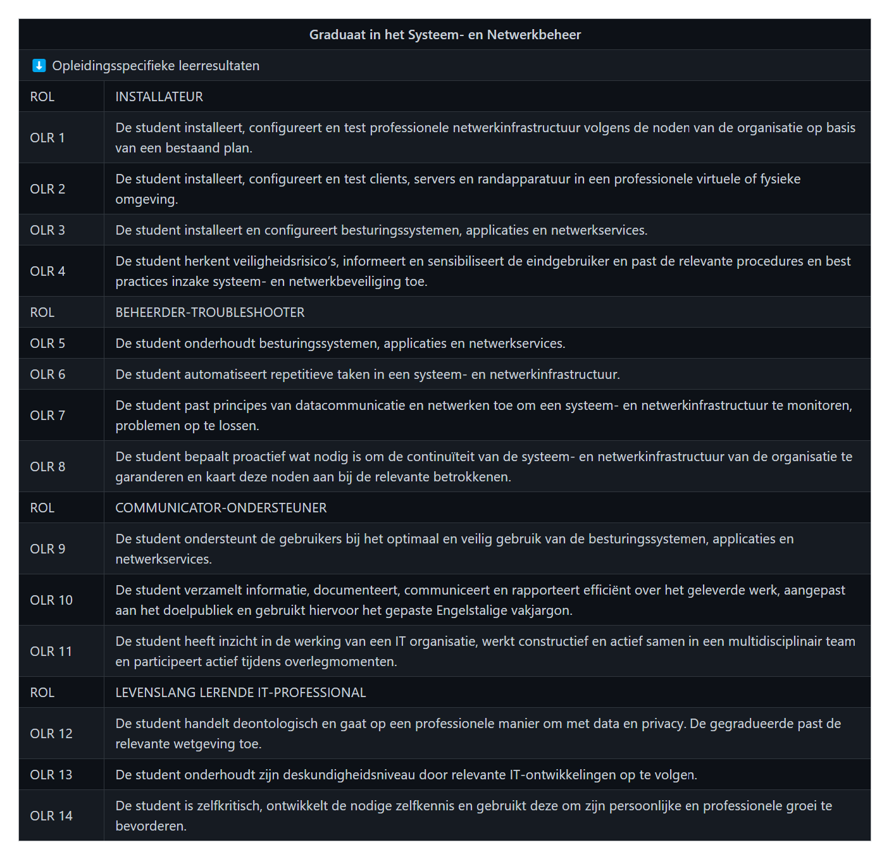

# Overzicht Ontwikkelingsgesprekken

## Overzicht ontwikkelingsgesprekken WPL 1

### Mijn keuze voor de opleiding:

Ik heb voor deze opleiding gekozen omdat ik gepassioneerd ben door technologie, computers en het beheer van IT-systemen. De IT-wereld verandert voortdurend, met nieuwe technologieën, tools en ideeën die regelmatig worden geïntroduceerd. Een opleiding in systeem- en netwerkbeheer helpt me op de hoogte te blijven van de nieuwste ontwikkelingen en biedt een solide basis om in de IT-wereld te werken. Systeem- en netwerkbeheerders hebben over het algemeen goede carrièremogelijkheden en beschikken vaak over vaardigheden die in veel verschillende industrieën en organisaties kunnen worden ingezet. Mijn doel is om zoveel mogelijk bij te leren en een succesvolle carrière op te bouwen.

### Mijn beeld van dit beroep:

Een systeem- en netwerkspecialist is verantwoordelijk voor het beheren, onderhouden en optimaliseren van computer- en netwerksystemen binnen een organisatie. Hier zijn enkele voorbeelden van wat het werk van een systeem- en netwerkspecialist kan inhouden:

Ontwerp en implementatie: Systeem- en netwerkspecialisten zijn vaak betrokken bij het ontwerpen en implementeren van IT-systemen. Dit omvat het plannen van netwerkinfrastructuren, het selecteren van hardware en software, en het opzetten van servers en andere belangrijke IT-componenten.

Onderhoud en monitoring: Een belangrijk deel van het werk is het onderhouden van de bestaande systemen en netwerken. Dit omvat het uitvoeren van regelmatige controles, updates, en het oplossen van eventuele problemen om ervoor te zorgen dat alles goed blijft draaien.

Beveiliging: Systeem- en netwerkspecialisten hebben ook vaak de verantwoordelijkheid om de beveiliging van IT-systemen te garanderen. Dit omvat het implementeren van beveiligingsmaatregelen, het monitoren van mogelijke bedreigingen en het nemen van maatregelen om de systemen te beschermen tegen aanvallen.

Troubleshooting: Wanneer zich problemen voordoen, is het de taak van de specialist om deze snel en efficiënt op te lossen. Dit kan variëren van het oplossen van netwerkproblemen tot het herstellen van serverfouten.
 
Op dit moment ben ik nog aan het ontdekken welke specifieke functie binnen de IT-sector het beste bij mij past. Het veld is zo uitgebreid en er zijn zoveel mogelijkheden dat ik nog in de fase van kennisopbouw en kennismaking met verschillende aspecten van de IT zit. Mijn voorkeur neigt echter naar de gebieden van cloud computing en kunstmatige intelligentie (AI). Ik besef dat er nog veel te leren valt en dat ik me moet verdiepen in specifieke aspecten voordat ik een beslissing kan nemen over mijn toekomstige carrière in de IT.

### Competenties systemen en netwerken:

De leerdoelstellingen voor iemand die afstudeert in een graduaat systemen en netwerken staan in volgende tabel samengevat:

Belangrijke leermomenten uit WPL1 omvatten het ontwikkelen van een professionele houding, het omgaan met anderen en het aanpakken van uitdagende opdrachten. Sterke punten die ik heb geïdentificeerd, zijn mijn gedrevenheid en optimisme bij het aanpakken van nieuwe taken en mijn enthousiasme om te leren.

Mijn soft skills omvatten een positieve instelling en passie voor mijn werk. In WPL2 wil ik me specifiek richten op mijn communicatieve vaardigheden, met als doel effectiever te communiceren en sterke relaties op te bouwen. Daarnaast wil ik mijn empathisch vermogen verbeteren om beter samen te werken met anderen. Ik kijk ernaar uit om deze ontwikkelpunten verder te versterken en te groeien gedurende dit semester.

## Overzicht ontwikkelingsgesprekken WPL 2

zie Opdrachten en Reflectie

## Overzicht ontwikkelingsgesprekken WPL 3

Tijdens mijn ontwikkelingsgesprekken kwamen enkele belangrijke aandachtspunten naar voren die mij helpen mijn werk efficiënter en gestructureerder aan te pakken. Een van de belangrijkste lessen is om niet te veel te multitasken, maar mij te focussen op het volledig afronden van opdrachten voordat ik aan een nieuwe taak begin. Dit helpt niet alleen om een hogere kwaliteit van werk te leveren, maar voorkomt ook dat taken blijven liggen. Daarnaast werd het belang van documenteren benadrukt. Door processen, oplossingen en veranderingen goed bij te houden, zorg ik ervoor dat ik later gemakkelijker kan teruggrijpen op eerdere werkzaamheden en dat mijn collega's of opvolgers ook baat hebben bij mijn werk. Deze punten zijn voor mij waardevolle inzichten om mijn professionele ontwikkeling verder te versterken.

Tijdens de voorbije periode van Werkplekleren heb ik veel geleerd en ben ik gegroeid in zowel technische als persoonlijke vaardigheden. Door met voor mij nieuwe technologieën te werken, heb ik mijn technische kennis en probleemoplossend vermogen verder ontwikkeld. Daarnaast heb ik meer inzicht gekregen in hoe ik mijn werk efficiënter kan plannen en prioriteren, wat mijn prestaties aanzienlijk heeft verbeterd.

Op persoonlijk vlak heb ik mijn vaardigheden verder ontwikkeld op het gebied van aanpassingsvermogen en probleemoplossend denken. Ik ben beter geworden in het inspelen op onverwachte situaties en het vinden van praktische oplossingen. Ook heb ik mijn zelforganisatie verbeterd, waardoor ik efficiënter met mijn tijd en taken omga. Daarnaast heb ik beter leren zelfstandig werken door veel zelf op te zoeken en problemen op eigen initiatief aan te pakken. Daarnaast ben ik assertiever geworden in het stellen van vragen en het zoeken van feedback, wat mijn professionele groei heeft gestimuleerd. Uit de feedback bleek dat ik trots mag zijn op mijn werk en dat proactief handelen belangrijk is.

[WPL3-FG-werkkwaliteiten_DanielsJonathan](https://github.com/PXL-Digital-SNE-Werkplekleren/portfolio-JonathanDanielsPXL/blob/main/WPL3-FG-werkkwaliteiten_DanielsJonathan.pdf)

[WPL3-FG-werkprestaties_DanielsJonathan](https://github.com/PXL-Digital-SNE-Werkplekleren/portfolio-JonathanDanielsPXL/blob/main/WPL3-FG-werkprestaties_DanielsJonathan.pdf)

[WPL3-EG-werkkwaliteiten_DanielsJonathan](https://github.com/PXL-Digital-SNE-Werkplekleren/portfolio-JonathanDanielsPXL/blob/main/WPL3-EG-werkkwaliteiten_DanielsJonathan.pdf)

[WPL3-EG-werkprestaties_DanielsJonathan](https://github.com/PXL-Digital-SNE-Werkplekleren/portfolio-JonathanDanielsPXL/blob/main/WPL3-EG-werkprestaties_DanielsJonathan.pdf)

## Overzicht ontwikkelingsgesprekken WPL 4

Tijdens de voorbije WPL-periode heb ik mijn technische kennis sterk uitgebreid: ik zette een Azure-testomgeving op, werkte aan AZ-900 en AZ-104-certificeringen en ontwikkelde diverse PowerShell- en Python-scripts om beheer- en back-uptaken te automatiseren. Door Zabbix-agents te implementeren en netwerkverkeer met Wireshark te analyseren, kon ik bottlenecks en packetloss snel opsporen en verhelpen. Tijdens security-tests met OWASP ZAP en Kali Linux kreeg ik inzicht in kwetsbaarheden van interne systemen en leerde ik passende tegenmaatregelen te nemen. Daarnaast verbeterde ik load-balancing tussen virtuele switches in VMware om de performance van testopstellingen te optimaliseren.

Op het vlak van soft skills heb ik geleerd mijn werk beter te plannen en prioriteiten te stellen, waardoor ik efficiënter met mijn tijd omga en taken volledig afrond voordat ik iets nieuws begin. Mijn zelfvertrouwen en zelfstandigheid namen toe doordat ik complexe vraagstukken steeds vaker in eigen beheer oploste en proactief initiatief nam. De feedback van mijn stagebegeleider benadrukte vooral mijn sterke probleemoplossend vermogen en technische zelfstandigheid, maar wees erop dat mijn documentatie nog gestructureerder en gedetailleerder moet zijn. Om daaraan te werken, gebruik ik nu vaste templates en geef ik regelmatig korte voortgangsupdates, zodat collega’s mijn werk eenvoudiger kunnen opvolgen.

[WPL4-FG-werkkwaliteiten_DanielsJonathan](https://github.com/PXL-Digital-SNE-Werkplekleren/portfolio-JonathanDanielsPXL/blob/main/WPL4-FG-werkkwaliteiten_DanielsJonathan.pdf)

[WPL4-FG-werkprestaties_DanielsJonathan](https://github.com/PXL-Digital-SNE-Werkplekleren/portfolio-JonathanDanielsPXL/blob/main/WPL4-FG-werkprestaties_DanielsJonathan.pdf)

[WPL4-EG-werkkwaliteiten_DanielsJonathan](https://github.com/PXL-Digital-SNE-Werkplekleren/portfolio-JonathanDanielsPXL/blob/main/WPL4-EG-werkkwaliteiten_DanielsJonathan.pdf)

[WPL4-EG-werkprestaties_DanielsJonathan](https://github.com/PXL-Digital-SNE-Werkplekleren/portfolio-JonathanDanielsPXL/blob/main/WPL4-EG-werkprestaties_DanielsJonathan.pdf)
