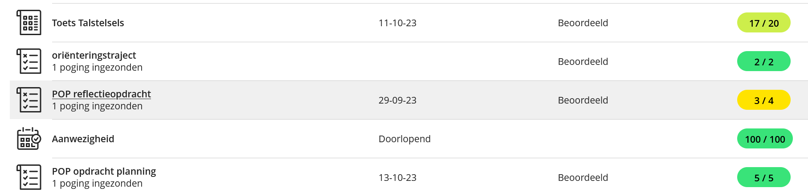

# Opdrachten

## Opdrachten WPL 1

### 1. POP reflectieopdracht  29-09-23 
(Korte persoonlijke reflectieopdracht)

[Daniels_Jonathan_reflectieopdracht-1.pdf](https://github.com/PXL-Digital-SNE-Werkplekleren/portfolio-JonathanDanielsPXL/files/13917982/Daniels_Jonathan_reflectieopdracht-1.pdf)

### 2. Toets Talstelsels  11-10-23 
(Test over deciamele, binaire, octale en hexadecimale talstelsels)

### 3. POP opdracht planning 13-10-23
(Schematische planning van 2 weken school)

[Daniels_Jonathan_planning-1.pdf](https://github.com/PXL-Digital-SNE-Werkplekleren/portfolio-JonathanDanielsPXL/files/13918031/Daniels_Jonathan_planning-1.pdf)

### 4. Carrièrekompas 14-10-23 
(Loopbaanplan opstellen)

[Daniels_Jonathan_mijn_loopbaan.pdf](https://github.com/PXL-Digital-SNE-Werkplekleren/portfolio-JonathanDanielsPXL/files/13918036/Daniels_Jonathan_mijn_loopbaan.pdf)

### 5. Link portfolio website 08-11-23 
(Github portfolio opdracht)

https://pxl-digital-sne-werkplekleren.github.io/portfolio-JonathanDanielsPXL/

### 6. Linux 13-12-23 
(Zelfstudie en korte test over linux shells)

### 7. Opdracht actualiteit 13-12-23 
(Reflectie opdracht over de impact van AI op de IT sector in willekeurig verdeelde groepen)

### 8. Opdracht netwerken 20-12-23 
(Configuratie files networks uploaden op github)

### 9. Power App OLR 22-12-23 
(Applicatie maken op powerapps) 

[Daniels_Jonathan_Template+opdracht+power+app.pdf](https://github.com/PXL-Digital-SNE-Werkplekleren/portfolio-JonathanDanielsPXL/files/13918063/Daniels_Jonathan_Template%2Bopdracht%2Bpower%2Bapp.pdf)

### Reflectie en resultaten:

Ik vond de leukste opdrachten de POP planning opdracht en de opdracht actualiteit. De planning opdracht vond ik leuk omdat ik een persoon ben die veel behoefte heeft aan orde en structuur een goede planning is dan ook zeer belangrijk voor mij. De opdracht actualiteit vond ik vooral leuk door het onderwerp van de opdracht en om de meningen van mijn medestudenten hierover eens te horen. Hierbij merkte ik dat deze toch wel vrij verdeeld waren. Uit deze opdrachten heb ik bijgeleerd hoe ik een goede planning kan maken en hoe ik goed kan leren samen werken met andere junior collegas die ik nog niet ken. Van de opdracht actualiteit moet ik mijn resulaat nog krijgen, het resulaat van de plannings opdracht heb ik hieronder afgebeeld.

## Opdrachten WPL 2

Tijdens WPL2 heb ik veel technische taken uitgevoerd die mijn vaardigheden hebben verbeterd. Als Eerste installeerde en configureerde ik Windows Server 2022, wat de basis vormde voor alles wat volgde. Ik heb een domeincontroller opgezet, wat belangrijk is voor netwerkbeheer. Een domeincontroller is een server die de gebruikers en computers in een netwerk beheert en beveiligt. Een van de moeilijkere opdrachten was het koppelen van een leersysteem (LMS) aan onze Active Directory (een database). Ik heb ook de beveiliging van onze systemen verbeterd door een wachtwoordbeheer systeem genaamd LAPS te installeren. Daarnaast heb ik een Linux-computer verbonden met onze Active Directory en een interne website voor communicatie opgezet. Tot slot heb ik instellingen en beveiliging voor de computers in de internetruimte beheerd met Group Policies. Door deze taken heb ik niet alleen mijn technische vaardigheden, maar ook mijn probleemoplossende en samenwerkingsvaardigheden verbeterd.

Gemaakte opdrachten:
1. Opdracht initiatie AWS
2. Opdracht templates AWS
3. Installatie Windows Server2022
4. Configuratie voor template windows Server2022
5. Installatie DC01 vanuit template
6. Linux Desktop koppelen aan AD
7. Implementeer LAPS
8. Windows-DNS server met forward en reverse lookup zone.
9. Zorg voor een LMS dat gekoppeld is aan de Active Directory.
10. Intranet site
11. Group Policies Internet Corner PC

[Eindpresentatie Team 18 PDF](https://github.com/PXL-Digital-SNE-Werkplekleren/portfolio-JonathanDanielsPXL/blob/f125c732722e5ec2648bd879e9fbe58822983952/WPL2_T18_Eindpresentatie.pdf)

[Een fragment uit het eindrapport](https://github.com/PXL-Digital-SNE-Werkplekleren/portfolio-JonathanDanielsPXL/blob/1a3cfe9a50f5f6a62cb034b4c90327fd6004f593/fragment.pdf)   

## Opdrachten WPL 3

Opdracht Werkkwaliteiten
[Opdracht Werkkwaliteiten](https://github.com/PXL-Digital-SNE-Werkplekleren/portfolio-JonathanDanielsPXL/blob/main/WPL3-SNE_Intervisie_Leerdoelen%20Werkkwaliteiten_DanielsJonathan_24.pdf)

Opdracht Probleemsituatie
[Opdracht Probleemsituatie](https://github.com/PXL-Digital-SNE-Werkplekleren/portfolio-JonathanDanielsPXL/blob/main/ProbleemsituatieWPL3_2SNEB_Daniels_Jonathan.pdf)

Opdracht Probleem-met-advies
[Opdracht Probleem-met-advies](https://github.com/PXL-Digital-SNE-Werkplekleren/portfolio-JonathanDanielsPXL/blob/main/ProbleemsituatieWPL3_2SNEB_Daniels_Jonathan_Naverwerking.pdf)

## Opdrachten WPL 4
