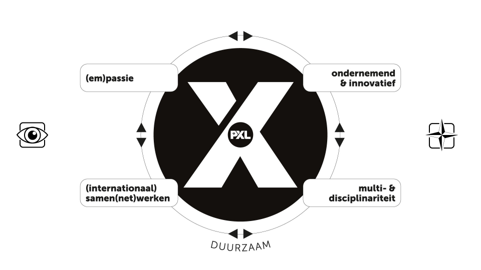

# Reflectie

## Reflectie WPL 1

## Mijn reflecties tijdens WPL1

Van welk resultaat van WPL1 ben je vooral trots en waarom? 

Ik ben het meest trots over mijn resultaat van de test over talstelsels omdat ik hier toch wel veel tijd en moeite in heb moeten steken. Wiskunde is ook totaal niet mijn sterkste kant en dit maakte dat het voor nog meer voldoening heeft gezorgd denk ik.

## X-factor

## Empassie

Wat is mijn passie? Hoe houdt dit verband met de opleiding?

Ik heb veel passies, soms maakt dit het moeillijk om te kiezen. Ik ben een zeer actief persoon ik ga gemiddeld 4 tot 5 keer per week naar de fitness en speel daarbuiten ook zaalvoetbal, ook ga ik regelmatig skaten en lopen. Daarnaast hou ik ook veel van muziek, films/series, kunst en architectuur waar ik me gamekkelijk uren mee kan bezig houden. Een andere passie van mij is reizen en het ontdekken van andere culturen. Ik ben al in veel verschillende landen geweest en het is mijn doel om er zo veel mogelijk te zien. Wat mij aangezet heeft tot het volgen van deze opleding is mijn passie voor voor alles wat met technologie te maken heeft, al van jongs af aan ben ik zeer geinteresseerd in computers maar ook in gsm's. Ik vind het dan ook zeer interessant om altijd up to date te zijn omtrent nieuwe technologie.

Wat geeft mij energie en goesting? En hoe zie je dit in je opleiding terugkomen?

In het verleden heb ik al veel verschillende jobs gehad, maar geen daarvan gaf me echt het gevoel van voldoening of waardering, dit zorgde er dan ook voor dat ik niet gemotiveerd was om ze te blijven doen. Ik hoop dat een diploma halen in de richting systeem en netwerkbeheer hier verandering in kan brengen. Dit is natuurlijk een enorme drijfveer voor mij, ik studeer voor een betere toekomst.

Hoe zie je jezelf in dialoog gaan met anderen in de opleiding die je bent aangevat?

In mijn opleiding wil ik op een respectvolle en professionele manier met medestudenten omgaan. Ik ga mijn gedachten delen, vragen stellen en luisteren naar wat mijn klasgenoten te zeggen hebben. Ik hoop dat we samen kunnen bijleren en het gezellig hebben.

Wat versta jij onder een ken-doementaliteit (ondernemend zijn in de brede zin van het woord) en hoe zie je dat in de opleiding die je bent aangevat?

Ik gebruik mijn huidige kennis als basis om in actie te komen. Ik ben actief bezig met het opdoen van meer kennis. In de wereld van IT betekent dit voortbouwen op wat ik al weet en tegelijkertijd gericht zoeken naar informatie over onderwerpen waar ik minder ervaring mee heb.

Hoe ver sta jij op dit moment al in een ken-doementaliteit?

Momenteel ben ik vooral nog bezig met een kennismaking van verschillende gebieden van de IT sector. Kennis opdoen en dingen bijleren zijn de zaken waar ik mij nu mee bezig houd.

## Internationaal Samen(net)werken

Hoe ziet jouw netwerk er op dit moment uit? Kan je dit netwerk inzetten in functie van de opleiding die je hebt aangevat?

Op dit moment heb ik nog niet zo een groot netwerk binnen de IT sector, het is dan ook mijn doel om dit op te bouwen. Ik beschik wel over een vrij goot persoonlijk netwerk. Want ik ben een  sociaal persoon en ik maak gemakkellijk nieuwe vrienden. Enkele van mijn vrienden werken ook in de IT sector en zij hebben mij ook aangeraden om de opleiding te volgen.

Hoe zou jij internationaal samen kunnen werken in de opleiding die je hebt aangevat?

Dit is spijtig genoeg door de VDAB momenteel niet toegelaten.

## Multi & disciplinariteit

Wat weet je op dit moment al over de inhouden van je opleiding?

We gaan leren over IT-gerelateerde dingen zoals Windows, Linux en netwerken. Tegelijkertijd gaan we ook ontdekken hoe dit echt in de praktijk werkt, zoals op de werkplek (WPL) en bij IT-organisation.

Met welke andere disciplines (opleidingen / beroepen / ...) zou jij in aanraking kunnen komen in je opleiding?

In een IT-opleiding kun je in aanraking komen met verschillende beroepen buiten de IT, afhankelijk van de specifieke focus en inhoud van je programma. Enkele voorbeelden zijn:

- Management en leiderschap
- Marketing
- Gezondheidszorg of onderwijs

## Reflectie op de X-factor

Hoe ziet je X-factor er op dit moment al uit? Welke ervaringen heb je al?

Ik heb al veel werkervaring maar dit was nooit binnen de IT sector.

Hoe zou je je X-factor kunnen vertalen naar de opleiding waarvoor je gekozen hebt?

Ik probeer dagelijks mijn vaardigheden en begrippen te vergroten, zodat ik beter voorbereid ben op de volgende fase van mijn loopbaan.

Hoe zou jij je X-factor verder kunnen ontwikkelen?

Mijn sterke punten kennen en weten wat mij uniek maakt.
Duidelijke doelen opstellen voor mezelf.
Altijd in leermodus blijven: deelnemen aan relevante trainingen/opledingen/certificaten.
Mijn netwerk bouw ik uit voor nieuwe ideeën en kansen.
Open staan voor nieuwe ervaringen want allen zo kan je groeien.
Regelmatig feedback vragen om te blijven groeien en om betere inzichten te bekomen.
Mijn successen en ideeën delen voor zichtbaarheid en reclame.
   
## Gastsprekers

Nathan Reviers - Carglass

Wat heb ik onthouden: Het is vooral belangrijk voor een service desk team om de WIP (work in progress) laag te houden. Dit zorgt voor een snellere opvolging van de incidenten en minder werkdruk voor de medewerkers.
Men moet ook zorgen voor excplicitie communicatie (duidelijk en volledig) net als werken volgens een Lean process, Itil komt hier ook bij aan bod. Ze werken volgens een 1ste lijn, 2de lijn en 3de lijns probleemverhelping.
Bij Carglass hebben ze er voor gezorgd dat de klantentevredenheid sinds 2020 tot 2023 van een 6,5/10 naar een 9/10 is gestegen door middel van bepaalde principes te hanteren en na te denken over hoe problemen beter en efficienter op te lossen. De WIP is dan ook van 400 incidenten naar 50 gezakt.
Een goed gedocumenteerde administratie zorgt ook voor een betere manier van werken waarbij je gemakkelijker met meerdere incidenten bezig kan zijn en deze ook over verschillende teamleden kan verdelen.

Wat heb ik bijgeleerd: Ik zie mezelf niet snel in een soortgelijke omgeving werken.

Niels Aerts - Xpose

Wat heb ik onthouden en bijgeleerd:

Niels maakte een zeer gedreven indruk op mij. Zijn presentatie was niet alleen overtuigend, maar bracht ook nieuwe inzichten en ideeën rond cyber security naar voren. Hij lijkt goed bezig te zijn, en ik ben enthousiast over de richting die hij opgaat. Zijn passie en denkwijze hebben mijn interesse gewekt. 

Vladimir Vets & Djen Van Rompay - Tergos

Wat heb ik onthouden en bijgeleerd:

De presentatie liet op mij een gemengde indruk achter. Terwijl Vladimir kennis over headhunting deelde, kwam zijn presentatie soms als te theoretisch voor mij over. Vaak had ik de indruk dat de focus vooral ligt op het vervullen van vacatures in plaats van de kandidaten goed te helpen. Dit is ook iets wat ik zelf al ervaren heb. Herhaalde en ongevraagde benaderingen door recruiters kunnen naar mijn mening als opdringerig worden ervaren, wat irritatie kan opwekken.

## Slotevaluatie

Wat weet je al over de soort van job die je later wil uitoefenen?

Als eerste job zou ik iets in de richting van Junior IT Consultant willen doen, om eravaring in het werkveld op te doen. Naarmate ik genoeg ervaring heb opgebouwd zou ik op termijn wel graag voor mezelf werken.

Waarover zou je nog wel een gastseminarie willen tijdens WPL2?

Quantum Computing en Zijn Toepassingen: Dit onderwerp lijkt mij zeer interessant.
Artificial Intelligence en Machine Learning : Bespreek concrete toepassingen van  ai in verschillende sectoren, met focus op uitdagingen.

Welk inzicht heeft WPL1 jou gebracht?

Werkveld-inzicht: Werkplekleren geeft mij een dieper inzicht in de dagelijkse werking van het vakgebied.
Samenwerking en Communicatie: Werkplekleren betekent vaak samenwerken met collega's en professionals in het veld.
Netwerken: WPL biedt ook kansen om te netwerken en professionele relaties op te bouwen, wat volgens mij waardevol kan zijn voor toekomstige carrièrekansen.

Wat hoop je in WPL2 te leren en ontdekken? Wat zijn je voornemens?

Ik ben enthousiast en nieuwsgierig over de mogelijkheid om meer praktijkgerichte projecten uit te voeren bij WPL2.
Ik blijf vastbesloten om mijn kennis op het gebied van IT uit te breiden. Mijn voornemen is om actief nieuwe technologieën te verkennen, de laatste ontwikkelingen te volgen en zowel theoretische als praktische expertise op te bouwen. Ik streef ernaar mijn vaardigheden voortdurend te verbeteren en mee te groeien met de evoluerende IT-sector.

## Reflectie WPL 2

### Persoonlijke eindreflectie:

Tijdens WPL2 heb ik een reeks opdrachten uitgevoerd die mijn technische en soft skills aanzienlijk hebben verbeterd. Hieronder geef ik een overzicht van mijn ervaringen en de vaardigheden die ik heb ontwikkeld.

Installatie Windows Server 2022: Deze taak was mijn eerste kennismaking met de nieuwste versie van Windows Server. De installatie verliep relatief vlot, hoewel ik enkele obstakels tegenkwam bij het configureren van de netwerkinstellingen. Dit leerde me geduld en doorzettingsvermogen.

Configuratie voor template Windows Server 2022: Het creëren van een configuratietemplate was een leerzaam proces. Het testen en documenteren van de configuratie verbeterde mijn vermogen om systematisch en nauwkeurig te werken.

Installatie DC01 vanuit template: Het opzetten van een domeincontroller vanuit de template was een cruciale taak. Dit ging vrij vlot dankzij de eerder gemaakte configuraties, en het gaf me inzicht in de waarde van een goede voorbereiding.

Linux Desktop koppelen aan AD: Dit was een uitdaging vanwege de verschillen tussen Windows en Linux systemen. Maar ik slaagde er vrij vlot in om de koppeling te maken, wat mijn probleemoplossende vaardigheden verbeterde.

Implementeer LAPS: De implementatie van Local Administrator Password Solution (LAPS) was nieuw voor me. Na wat onderzoek en testen, begreep ik de noodzaak en voordelen van deze beveiligingsmaatregel. Het duurde echter even voordat ik het werkend kreeg, wat mijn geduld en doorzettingsvermogen verder ontwikkelde.

Windows-DNS server met forward en reverse lookup zone: Het configureren van de DNS server was technisch complex, maar essentieel voor het netwerkbeheer. Dit project versterkte mijn begrip van DNS en netwerkarchitectuur.

LMS gekoppeld aan Active Directory: Het integreren van een Learning Management System (LMS) met AD was een van de moeilijkste taken. Het vereiste diepgaand onderzoek en vele tests, wat mijn vermogen om met complexe systemen te werken vergrootte.

Intranet site: Het opzetten van een intranet site was een creatieve opdracht waar ik mijn webdesign en configuratie vaardigheden kon toepassen. Dit project versterkte mijn kennis van webservers en content management systemen.

Group Policies voor Internet Corner PC: Het configureren van Group Policies voor specifieke gebruikersgroepen was eveneens een van de moeilijkste opdrachten. Dit vereiste een grondige planning en testing, en verbeterde mijn begrip van groepsbeleid en hun impact op de gebruikerservaring.

Reflectie: 

Wat ging goed: Ik heb veel geleerd over het installeren en configureren van servers, de integratie van verschillende systemen en het oplossen van technische problemen.

Wat ging minder goed: LMS integratie met AD duurde lang net als de implemantatie van LAPS en het configureren van Group Policies dit vond ik de moeilijkste taken en deze vergden veel tijd en moeite.

Teamsamenwerking: We werkten goed samen als team, waarbij we regelmatig kennis en oplossingen uitwisselden. Dit heeft mijn communicatieve vaardigheden versterkt.

Groeimomenten: Ik ben gegroeid in mijn vermogen om problemen te diagnosticeren en op te lossen zonder te panikeren. Doorzettingsvermogen en geduld bleken cruciaal.

Technische skills: Mijn kennis van Windows Server, Active Directory, DNS configuratie en systeembeveiliging is aanzienlijk toegenomen.

Soft skills: Ik heb mijn teamwork, communicatie en probleemoplossend vermogen verbeterd. Door intensieve samenwerking heb ik geleerd effectief te communiceren en samen te werken aan gemeenschappelijke doelen.

Dankwoord:

En natuurlijk, een speciale dank aan mijn teamgenoten voor de geweldige samenwerking. Zonder jullie was ik nu misschien nog steeds verdwaald in de command line!

## Reflectie WPL 3

## Reflectie WPL 4
